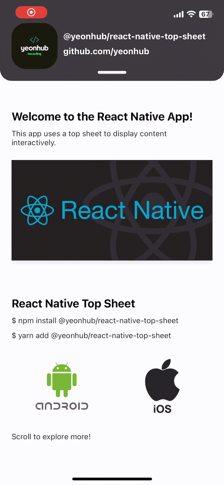

# @yeonhub/react-native-top-sheet

A top sheet library for React-Native 🎯

<div style="display: flex; gap: 10px;">
  
  
</div>

### 언어

- <a href=".//README.kr.md" style="display: flex; align-items: center; font-size : 18px; font-weight : 800">
    
    한국어 버전
  </a>

### Dependencies

📢 This library depends on the following two libraries:

  


## Support

<div style="display: flex; justify-content: space-between; width :350px; height : 100px">
  
  
  
</div>

---

# Installation Guide

## React Native CLI Users

### 1. Install the Library

You can install the `@yeonhub/react-native-top-sheet` package using either `npm` or `yarn`:

#### Using npm:

```sh
npm install @yeonhub/react-native-top-sheet
```

#### Using yarn:

```sh
yarn add @yeonhub/react-native-top-sheet
```

### 2. Install Dependencies

This library has the following dependencies that you need to install manually:

#### Using npm:

```sh
npm install react-native-gesture-handler react-native-reanimated
```

#### Using yarn:

```sh
yarn add react-native-gesture-handler react-native-reanimated
```

### 3. Update `babel.config.js`

In order to use `react-native-reanimated`, you need to add the plugin in your `babel.config.js` file. Add the following line to the `plugins` array:

```js
module.exports = {
  ...
  plugins: ['react-native-reanimated/plugin'],
};
```

### 4. Wrap the Root Component with `GestureHandlerRootView`

To ensure proper functionality of gesture handlers, wrap your root component (e.g., `App.js` or `App.tsx`) with `GestureHandlerRootView`:

```js
import React from 'react';
import { GestureHandlerRootView } from 'react-native-gesture-handler';
import App from './App'; // Your main component

export default function Main() {
  return (
    <GestureHandlerRootView style={{ flex: 1 }}>
      <App />
    </GestureHandlerRootView>
  );
}
```

---

## Expo Users

### 1. Install the Library

To install the library in an Expo project, use the following command:

```sh
npx expo install @yeonhub/react-native-top-sheet
```

### 2. Wrap the Root Component with `GestureHandlerRootView`

Similar to the CLI setup, wrap your root component with `GestureHandlerRootView` to ensure proper handling of gestures:

```js
import React from 'react';
import { GestureHandlerRootView } from 'react-native-gesture-handler';
import App from './App'; // Your main component

export default function Main() {
  return (
    <GestureHandlerRootView style={{ flex: 1 }}>
      <App />
    </GestureHandlerRootView>
  );
}
```

### 3. Optional: Using `ScrollView` in `TopSheet CollapsedContent/ExpandedContent`

If you want to use `ScrollView` from `react-native-gesture-handler` within the collapsed or expanded content, you must verify the version of `react-native-gesture-handler`:

#### If your Expo project is using `react-native-gesture-handler` version **2.22.0** or above:

```js
import { ScrollView } from 'react-native-gesture-handler';
```

#### If your Expo project is using a version **lower than 2.22.0**, you may face compatibility issues with the built-in `GestureHandlerRootView`. In this case, you should update `react-native-gesture-handler`:

```sh
npm uninstall react-native-gesture-handler
npm install react-native-gesture-handler
```

Then, you can proceed with using `ScrollView` as usual:

```js
import { ScrollView } from 'react-native-gesture-handler';
```

---

## Troubleshooting

### 1. **Invariant Violation: Tried to register two views with the same name `RNGestureHandlerRootView`**

If you encounter the following error:

```
Invariant Violation: Tried to register two views with the same name `RNGestureHandlerRootView`
```

This means that `GestureHandlerRootView` is being used more than once in the app, which is not allowed.

#### Solution:

- **For CLI Users:**
  Check if your app is already wrapping the root component with `GestureHandlerRootView`. If you have already used it in your code, remove any additional wrapping. `react-native-gesture-handler` might be automatically applying this wrapper.

- **For Expo Users:**
  Expo SDK versions, along with certain versions of `react-native-gesture-handler`, may already automatically wrap the root component with `GestureHandlerRootView`. In this case, remove the manual wrapping of your root component with `GestureHandlerRootView`.

This will resolve the conflict by ensuring that there is only one instance of `GestureHandlerRootView` in the app.

## Features

1. **Customizable Top Sheet Height**: You can adjust the height of the top sheet for both collapsed and expanded states, giving you flexibility in design.

2. **Customizable Top Sheet Content**: You can add your own content inside the top sheet for both collapsed and expanded states, making it fully customizable to your needs.

3. **Customizable Top Sheet Background Color**: The background color of the top sheet can be easily customized to match your app’s design.

4. **Toggle Button Visibility**: You can choose whether to show or hide the expand/collapse button, providing a cleaner look when needed.

5. **Adjustable Toggle Touch Area**: Customize the height of the touchable area around the toggle button for better user interaction.

6. **Customizable Border Radius**: Customize the corner radius (border radius) of the top sheet to fit your design preferences.

7. **Customizable Animation Speed**: Adjust the speed of the top sheet's opening/closing animation for a smoother or faster experience.

8. **Change Callbacks**: Listen to sheet state changes with callbacks for expand, collapse, and general state changes, enabling custom actions triggered by user interactions.

## Usage

```js
import { TopSheet } from '@yeonhub/react-native-top-sheet';

// Example usage in your component
const MyComponent = () => {
  return (
    <TopSheet
      minHeightFactor={3}
      maxHeightFactor={1.5}
      showBtn={true}
      // State change callbacks
      onExpand={() => console.log('Sheet expanded')}
      onCollapse={() => console.log('Sheet collapsed')}
      onChange={(isExpanded) =>
        console.log(`Sheet is ${isExpanded ? 'expanded' : 'collapsed'}`)
      }
      // Other props
      CollapsedContent={
        <View>
          <Text>React Native Top Sheet</Text>
        </View>
      }
      ExpandedContent={
        <View>
          <Text>React Native Top Sheet</Text>
          {/* Add more items as needed */}
        </View>
      }
    />
  );
};
```

## ⚠️ Important Notes

- **ScrollView Usage**: When using a `ScrollView` inside the top sheet, do **not** use the default `ScrollView` from React Native. Instead, import it from `react-native-gesture-handler` to ensure smooth scrolling interactions within the top sheet.
  ```js
  import { ScrollView } from 'react-native-gesture-handler';
  ```

## Contributing

See the [contributing guide](CONTRIBUTING.md) to learn how to contribute to the repository and the development workflow.

## Default Configuration

The following are the default values for the `TopSheet` component, which you can customize:

| **Property**            | **Default Value** | **Type**   | **Description**                                                                                                                                                                                                                     |
| ----------------------- | ----------------- | ---------- | ----------------------------------------------------------------------------------------------------------------------------------------------------------------------------------------------------------------------------------- |
| `minHeightFactor`       | 6                 | `number`   | The height of the top sheet when collapsed. Smaller values result in taller sheets. This value divides the screen height to calculate the minimum height of the top sheet (e.g., `minSheetHeight = height / minHeightFactor`).      |
| `maxHeightFactor`       | 2                 | `number`   | The height of the top sheet when expanded. Smaller values result in shorter sheets. This value divides the screen height to calculate the maximum height of the top sheet (e.g., `maxSheetHeight = height / maxHeightFactor`).      |
| `borderBackgroundColor` | 'transparent'     | `string`   | The background color that will fill the area created by the border radius. If the content under the top sheet has a background color, set `borderBackgroundColor` to match it so the space created by the border radius is covered. |
| `topsheetColor`         | 'gray'            | `string`   | The background color of the top sheet.                                                                                                                                                                                              |
| `btnColor`              | 'black'           | `string`   | The background color of the toggle button.                                                                                                                                                                                          |
| `btnHeight`             | 5                 | `number`   | The height of the toggle button.                                                                                                                                                                                                    |
| `btnWidth`              | 50                | `number`   | The width of the toggle button.                                                                                                                                                                                                     |
| `touchableArea`         | 20                | `number`   | The height of the touchable area for the toggle button.                                                                                                                                                                             |
| `radius`                | 20                | `number`   | The radius (corner rounding) of the top sheet.                                                                                                                                                                                      |
| `showBtn`               | `true`            | `boolean`  | Whether or not to show the toggle button.                                                                                                                                                                                           |
| `damping`               | 10                | `number`   | The damping of the spring animation (controls how bouncy it is). Must be a value between **1 and 100**. Default is 10.                                                                                                              |
| `stiffness`             | 400               | `number`   | The stiffness of the spring animation (controls how fast it moves). Must be a value between **1 and 500**. Default is 400.                                                                                                          |
| `onExpand`              | `undefined`       | `function` | A callback function that is triggered when the sheet is fully expanded (at bottom position). Useful for triggering actions when the sheet expands.                                                                                  |
| `onCollapse`            | `undefined`       | `function` | A callback function that is triggered when the sheet is fully collapsed (at top position). Useful for triggering actions when the sheet collapses.                                                                                  |
| `onChange`              | `undefined`       | `function` | A callback function that receives the current expansion state (`isExpanded`) as a parameter. This is called whenever the sheet transitions between expanded and collapsed states.                                                   |

You can customize these values by passing them as props to the `TopSheet` component.

## License

MIT

---

```

```
