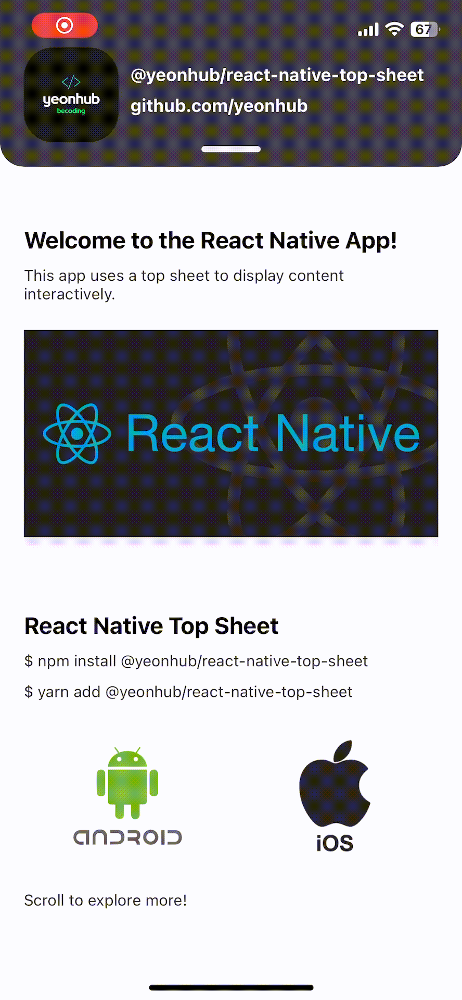

# @yeonhub/react-native-top-sheet

A top sheet library for React-Native 🎯

<div style="display: flex; gap: 10px;">
  
  
</div>

### 언어

- <a href="./README.kr.md" style="display: flex; align-items: center; font-size : 18px; font-weight : 800">
    
    한국어 버전
  </a>

### Dependencies

📢 This library depends on the following two libraries:

  


## Installation

You can install the package using either `npm` or `yarn`:

### Using npm:

```sh
npm install @yeonhub/react-native-top-sheet
```

### Using yarn:

```sh
yarn add @yeonhub/react-native-top-sheet
```

## Features

1. **Customizable Top Sheet Height**: You can adjust the height of the top sheet for both collapsed and expanded states, giving you flexibility in design.

2. **Customizable Top Sheet Content**: You can add your own content inside the top sheet for both collapsed and expanded states, making it fully customizable to your needs.

3. **Customizable Top Sheet Background Color**: The background color of the top sheet can be easily customized to match your app’s design.

4. **Toggle Button Visibility**: You can choose whether to show or hide the expand/collapse button, providing a cleaner look when needed.

5. **Adjustable Toggle Touch Area**: Customize the height of the touchable area around the toggle button for better user interaction.

6. **Customizable Border Radius**: Customize the corner radius (border radius) of the top sheet to fit your design preferences.

7. **Customizable Animation Speed**: Adjust the speed of the top sheet's opening/closing animation for a smoother or faster experience.

## Usage

```js
import { TopSheet } from '@yeonhub/react-native-top-sheet';

// Example usage in your component
const MyComponent = () => {
  return (
    <TopSheet
      minHeightFactor={3}
      maxHeightFactor={1.5}
      showBtn={true}
      // Other props
      CollapsedTopSheetContent={
        <View>
          <Text>React Native Top Sheet</Text>
        </View>
      }
      ExpandedTopSheetContent={
        <View>
          <Text>React Native Top Sheet</Text>
          {/* Add more items as needed */}
        </View>
      }
    />
  );
};
```

## ⚠️ Important Notes

- **ScrollView Usage**: When using a `ScrollView` inside the top sheet, do **not** use the default `ScrollView` from React Native. Instead, import it from `react-native-gesture-handler` to ensure smooth scrolling interactions within the top sheet.
  ```js
  import { ScrollView } from 'react-native-gesture-handler';
  ```

## Contributing

See the [contributing guide](CONTRIBUTING.md) to learn how to contribute to the repository and the development workflow.

## Default Configuration

The following are the default values for the `TopSheet` component, which you can customize:

| **Property**            | **Default Value** | **Type**  | **Description**                                                                                                                                                                                                                     |
| ----------------------- | ----------------- | --------- | ----------------------------------------------------------------------------------------------------------------------------------------------------------------------------------------------------------------------------------- |
| `minHeightFactor`       | 6                 | `number`  | The height of the top sheet when collapsed. Smaller values result in taller sheets. This value divides the screen height to calculate the minimum height of the top sheet (e.g., `minSheetHeight = height / minHeightFactor`).      |
| `maxHeightFactor`       | 2                 | `number`  | The height of the top sheet when expanded. Smaller values result in shorter sheets. This value divides the screen height to calculate the maximum height of the top sheet (e.g., `maxSheetHeight = height / maxHeightFactor`).      |
| `borderBackgroundColor` | 'transparent'     | `string`  | The background color that will fill the area created by the border radius. If the content under the top sheet has a background color, set `borderBackgroundColor` to match it so the space created by the border radius is covered. |
| `topsheetColor`         | 'gray'            | `string`  | The background color of the top sheet.                                                                                                                                                                                              |
| `btnColor`              | 'black'           | `string`  | The background color of the toggle button.                                                                                                                                                                                          |
| `btnHeight`             | 5                 | `number`  | The height of the toggle button.                                                                                                                                                                                                    |
| `btnWidth`              | 50                | `number`  | The width of the toggle button.                                                                                                                                                                                                     |
| `touchableArea`         | 20                | `number`  | The height of the touchable area for the toggle button.                                                                                                                                                                             |
| `radius`                | 20                | `number`  | The radius (corner rounding) of the top sheet.                                                                                                                                                                                      |
| `showBtn`               | `true`            | `boolean` | Whether or not to show the toggle button.                                                                                                                                                                                           |
| `damping`               | 10                | `number`  | The damping of the spring animation (controls how bouncy it is).                                                                                                                                                                    |
| `stiffness`             | 400               | `number`  | The stiffness of the spring animation (controls how fast it moves).                                                                                                                                                                 |

You can customize these values by passing them as props to the `TopSheet` component.

## License

MIT

---
